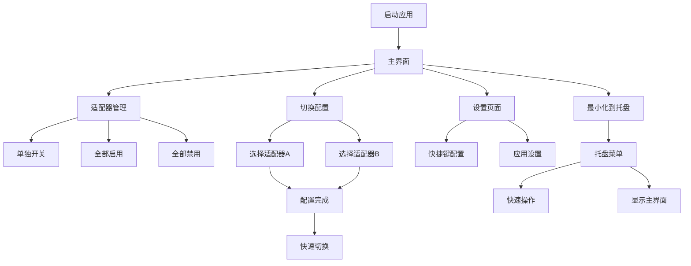

# 网络适配器管助手 - 产品需求文档

## 1. 产品概述

网络适配器管助手是一款专为Windows用户设计的桌面应用程序，旨在简化网络适配器的管理和切换操作。
该产品解决了用户在多网络环境下频繁手动切换网络适配器的痛点，提供一键式操作和全局快捷键支持，显著提升用户的网络管理效率。
目标是成为Windows平台上最便捷的网络适配器管理工具，服务于需要频繁切换网络环境的专业用户和技术人员。

## 2. 核心功能

### 2.1 用户角色

本产品为单用户桌面应用程序，无需区分用户角色，所有功能对使用者开放。

### 2.2 功能模块

我们的网络适配器管助手包含以下主要页面：
1. **主界面**：网络适配器列表、开关控件、全局操作按钮、适配器切换配置
2. **设置页面**：快捷键配置、应用程序设置、权限管理
3. **系统托盘**：托盘图标、右键菜单、快速操作

### 2.3 页面详情

| 页面名称 | 模块名称 | 功能描述 |
|----------|----------|----------|
| 主界面 | 适配器列表 | 显示所有网络适配器，包含名称、状态、类型图标。提供单独的开关控件启用/禁用每个适配器 |
| 主界面 | 全局操作区 | 提供"全部启用"和"全部禁用"按钮，一键操作所有适配器状态 |
| 主界面 | 切换配置区 | 允许用户选择两个网络适配器进行互斥切换配置，显示当前配置状态 |
| 主界面 | 快速切换 | 提供切换按钮，在配置的两个适配器间进行互斥切换操作 |
| 设置页面 | 快捷键配置 | 配置全部启用、全部禁用、网络切换三个全局快捷键 |
| 设置页面 | 应用设置 | 开机自启动、最小化到托盘、管理员权限等选项配置 |
| 系统托盘 | 托盘图标 | 显示应用状态，支持左键显示主界面，右键显示功能菜单 |
| 系统托盘 | 右键菜单 | 包含全部启用、全部禁用、网络切换、显示主界面、退出程序选项，显示对应快捷键 |

## 3. 核心流程

**主要用户操作流程：**

用户启动应用程序后，可以在主界面查看所有网络适配器的状态。用户可以通过单独的开关控件启用或禁用特定适配器，也可以使用全局按钮一键操作所有适配器。

对于需要频繁切换的场景，用户可以在切换配置区选择两个适配器（如WLAN和以太网），配置完成后可以通过切换按钮或快捷键在两者间进行互斥切换。

用户可以在设置页面自定义三个全局快捷键，并配置应用程序的行为选项。应用程序支持最小化到系统托盘，用户可以通过托盘图标快速访问主要功能。

## 4. 用户界面设计

### 4.1 设计风格

- **主色调**：#0078D4（Windows蓝）、#FFFFFF（白色）
- **辅助色**：#F3F2F1（浅灰）、#323130（深灰）、#107C10（绿色-启用状态）、#D13438（红色-禁用状态）
- **按钮风格**：圆角矩形按钮，符合Fluent Design规范，支持悬停和点击效果
- **字体**：Segoe UI，主要文字14px，标题16px，说明文字12px
- **布局风格**：卡片式布局，顶部导航，左右分栏设计
- **图标风格**：使用Segoe MDL2 Assets字体图标，简洁现代

### 4.2 页面设计概览

| 页面名称 | 模块名称 | UI元素 |
|----------|----------|---------|
| 主界面 | 适配器列表 | 卡片式列表，每项包含适配器图标、名称、状态指示器、Toggle开关。使用#F3F2F1背景，圆角8px |
| 主界面 | 全局操作区 | 两个并排按钮，#0078D4背景，白色文字，圆角4px，悬停时透明度90% |
| 主界面 | 切换配置区 | 下拉选择框样式，选中项高亮显示，配置状态用绿色圆点指示 |
| 设置页面 | 快捷键配置 | 输入框样式，支持键盘监听，显示当前绑定的快捷键组合 |
| 系统托盘 | 托盘图标 | 16x16像素图标，根据网络状态变化颜色（蓝色-正常，灰色-无网络） |

### 4.3 响应式设计

应用程序为桌面优先设计，最小窗口尺寸800x600像素，支持窗口缩放。界面元素采用相对布局，确保在不同分辨率下的良好显示效果。支持Windows 10/11的高DPI显示器。