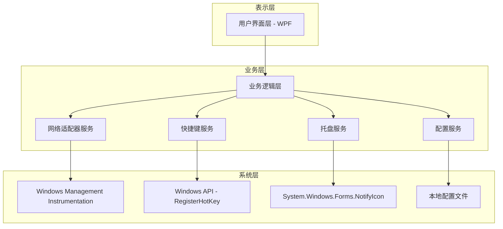
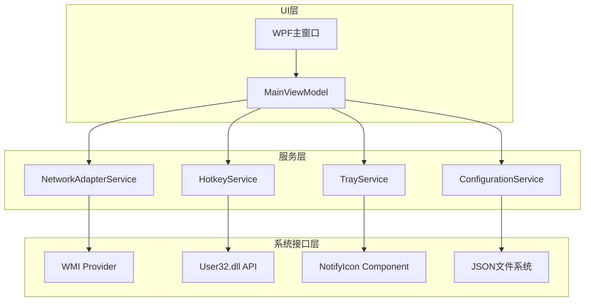
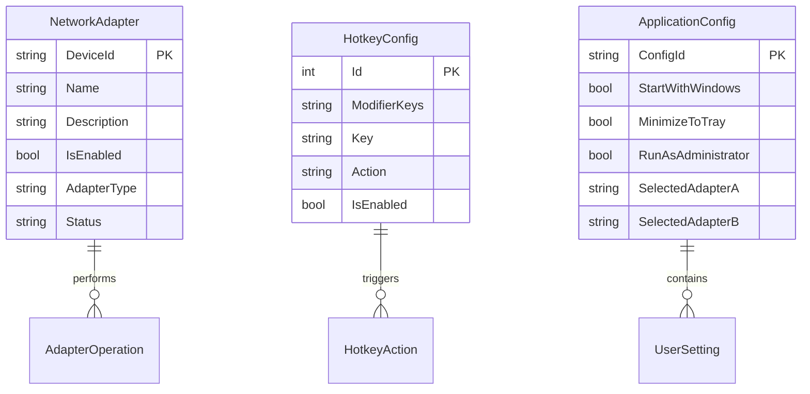

# 网络适配器管助手 - 技术架构文档

## 1. 架构设计



## 2. 技术描述

* 前端：WPF (.NET 6) + XAML + Material Design In XAML Toolkit

* 后端：无独立后端服务

* 系统集成：Windows Management Instrumentation (WMI) + Windows API

* 配置存储：JSON文件本地存储

## 3. 路由定义

| 路由              | 用途                   |
| --------------- | -------------------- |
| /MainWindow     | 主界面窗口，显示网络适配器列表和管理功能 |
| /SettingsWindow | 设置窗口，配置快捷键和应用程序选项    |
| /TrayIcon       | 系统托盘图标和右键菜单功能        |

## 4. API定义

### 4.1 核心API

网络适配器管理相关

```
NetworkAdapterService.GetAllAdapters()
```

返回值：

| 参数名称     | 参数类型                 | 描述        |
| -------- | -------------------- | --------- |
| Adapters | List<NetworkAdapter> | 所有网络适配器列表 |

示例：

```json
[
  {
    "Name": "WLAN",
    "Description": "Intel(R) Wi-Fi 6 AX101",
    "IsEnabled": true,
    "AdapterType": "Wireless",
    "DeviceId": "PCI\\VEN_8086&DEV_A0F0"
  }
]
```

```
NetworkAdapterService.EnableAdapter(string deviceId)
NetworkAdapterService.DisableAdapter(string deviceId)
```

请求参数：

| 参数名称     | 参数类型   | 是否必需 | 描述        |
| -------- | ------ | ---- | --------- |
| deviceId | string | true | 网络适配器设备ID |

返回值：

| 参数名称    | 参数类型    | 描述     |
| ------- | ------- | ------ |
| Success | boolean | 操作是否成功 |
| Message | string  | 操作结果消息 |

快捷键管理相关

```
HotkeyService.RegisterHotkey(HotkeyConfig config)
HotkeyService.UnregisterHotkey(int hotkeyId)
```

请求参数：

| 参数名称   | 参数类型         | 是否必需 | 描述      |
| ------ | ------------ | ---- | ------- |
| config | HotkeyConfig | true | 快捷键配置对象 |

示例：

```json
{
  "Id": 1,
  "ModifierKeys": "Control,Alt",
  "Key": "F1",
  "Action": "EnableAll"
}
```

## 5. 服务架构图



## 6. 数据模型

### 6.1 数据模型定义



### 6.2 数据定义语言

配置文件结构 (appsettings.json)

```json
{
  "ApplicationSettings": {
    "StartWithWindows": false,
    "MinimizeToTray": true,
    "RunAsAdministrator": true,
    "SelectedAdapterA": "",
    "SelectedAdapterB": "",
    "WindowPosition": {
      "X": 100,
      "Y": 100,
      "Width": 800,
      "Height": 600
    }
  },
  "HotkeySettings": [
    {
      "Id": 1,
      "Action": "EnableAll",
      "ModifierKeys": "Control,Alt",
      "Key": "F1",
      "IsEnabled": true
    },
    {
      "Id": 2,
      "Action": "DisableAll",
      "ModifierKeys": "Control,Alt",
      "Key": "F2",
      "IsEnabled": true
    },
    {
      "Id": 3,
      "Action": "SwitchAdapters",
      "ModifierKeys": "Control,Alt",
      "Key": "F3",
      "IsEnabled": true
    }
  ]
}
```

网络适配器数据模型

```csharp
public class NetworkAdapter
{
    public string DeviceId { get; set; }
    public string Name { get; set; }
    public string Description { get; set; }
    public bool IsEnabled { get; set; }
    public AdapterType Type { get; set; }
    public string Status { get; set; }
    public DateTime LastUpdated { get; set; }
}

public enum AdapterType
{
    Ethernet,
    Wireless,
    Bluetooth,
    Virtual,
    Other
}
```

快捷键配置模型

```csharp
public class HotkeyConfig
{
    public int Id { get; set; }
    public string Action { get; set; }
    public ModifierKeys ModifierKeys { get; set; }
    public Key Key { get; set; }
    public bool IsEnabled { get; set; }
}

public enum HotkeyAction
{
    EnableAll,
    DisableAll,
    SwitchAdapters
}
```

