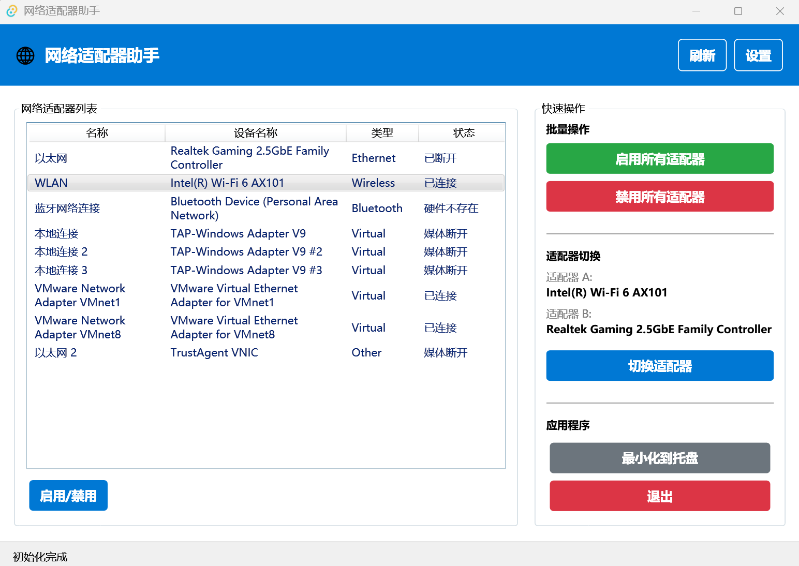

# 网络适配器管助手 (Network Adapter Helper)

一个用于管理Windows网络适配器的桌面应用程序，支持快速启用/禁用网络适配器、全局快捷键操作和系统托盘管理。

## 功能特性

### 核心功能
- **网络适配器管理**: 查看、启用、禁用网络适配器
- **批量操作**: 一键启用/禁用所有适配器
- **智能适配器切换**: 在两个预配置适配器之间进行互斥切换
- **实时状态监控**: 显示适配器连接状态和类型

### 用户界面
- **现代化界面**: 基于Material Design的WPF界面
- **系统托盘**: 最小化到系统托盘，支持右键菜单操作
- **设置窗口**: 配置应用程序行为和快捷键

### 高级功能
- **全局快捷键**: 支持自定义快捷键进行快速操作
- **管理员权限**: 自动检测和提升管理员权限
- **配置持久化**: JSON格式保存用户配置
- **开机启动**: 可选择随Windows启动

## 系统要求

- Windows 10/11
- .NET 8.0 Runtime
- 管理员权限（用于网络适配器管理）

## 安装和运行

### 从源码构建

1. 克隆或下载项目源码
2. 确保已安装 .NET 8.0 SDK
3. 在项目根目录运行构建命令：

```bash
dotnet build --configuration Release
```

4. 以管理员身份运行应用程序：

```bash
# 方法1: 直接运行可执行文件
.\bin\Release\net8.0-windows\NetworkAdapterHelper.exe

# 方法2: 使用dotnet运行
dotnet run --configuration Release
```

### 使用构建脚本

项目包含一个PowerShell构建脚本，可以自动构建发布版本：

```powershell
# 以管理员身份运行PowerShell，然后执行：
powershell -ExecutionPolicy Bypass -File build_release.ps1 -Version {version}
```

该脚本会：
- 构建多种发布版本（单文件、框架依赖等）
- 生成安装包（完整版和精简版）
- 输出到 `artifacts` 目录

## 使用说明

### 主窗口操作

1. **查看适配器**: 启动应用程序后，主窗口会显示所有网络适配器列表
2. **启用/禁用**: 选择适配器，点击"启用"或"禁用"按钮
3. **刷新列表**: 点击"刷新"按钮更新适配器状态
4. **批量操作**: 使用"启用所有"或"禁用所有"按钮

### 系统托盘功能

- **最小化到托盘**: 关闭主窗口时应用程序会最小化到系统托盘
- **右键菜单**: 右键点击托盘图标可以：
  - 显示主窗口
  - 打开设置
  - 快速操作：
    - 启用所有适配器
    - 禁用所有适配器
    - **切换适配器**（在配置的两个适配器间切换）
  - 网络适配器列表（显示所有适配器及其状态）
  - 刷新适配器列表
  - 退出应用程序

### 全局快捷键设置

应用程序支持设置全局快捷键，即使在其他应用程序中也能快速执行操作：

#### 配置步骤
1. 打开设置窗口
2. 在"快捷键设置"部分点击对应操作的"设置"按钮
3. 在弹出的对话框中按下想要设置的快捷键组合
4. 点击"确定"保存设置

#### 支持的快捷键操作
- **启用所有适配器**: 一键启用所有网络适配器
- **禁用所有适配器**: 一键禁用所有网络适配器  
- **切换适配器**: 在配置的两个适配器之间进行智能切换

#### 快捷键建议
- 启用所有适配器: `Ctrl+Shift+E`
- 禁用所有适配器: `Ctrl+Shift+D`
- 切换适配器: `Ctrl+Shift+S`

> **注意**: 请避免使用已被其他应用程序占用的快捷键组合

### 智能适配器切换功能

这是本应用的核心特色功能，允许您在两个预配置的网络适配器之间进行智能互斥切换：

#### 功能特点
- **互斥切换**: 确保同一时间只有一个适配器处于启用状态
- **智能判断**: 自动检测当前启用的适配器并切换到另一个
- **状态保护**: 切换过程中有1秒延迟确保适配器状态稳定
- **多种触发方式**: 支持主窗口按钮、系统托盘菜单、全局快捷键

#### 切换逻辑
1. **适配器A启用时**: 禁用适配器A → 启用适配器B
2. **适配器B启用时**: 禁用适配器B → 启用适配器A  
3. **两个都未启用时**: 默认启用适配器A
4. **两个都启用时**: 按照上述逻辑进行切换

#### 使用场景
- **有线/无线切换**: 在以太网和Wi-Fi之间快速切换
- **网络环境切换**: 在不同网络配置之间切换
- **故障排除**: 快速测试不同网络连接

#### 配置步骤
1. 打开设置窗口
2. 在"适配器切换配置"部分：
   - 选择**适配器A**（主要适配器）
   - 选择**适配器B**（备用适配器）
   - 确保两个适配器不是同一个
3. 可选：设置切换适配器的全局快捷键
4. 保存配置

#### 操作方式
- **主窗口**: 点击"切换适配器"按钮
- **系统托盘**: 右键菜单选择"切换适配器"
- **快捷键**: 使用配置的全局快捷键（如 Ctrl+Shift+S）

### 其他配置选项

- **开机启动**: 设置应用程序随Windows启动
- **最小化到托盘**: 配置关闭窗口时的行为
- **管理员模式**: 自动以管理员权限运行

## 技术架构

### 项目结构

```
NetworkAdapterHelper/
├── Models/                    # 数据模型
│   ├── ApplicationConfig.cs   # 应用程序配置模型
│   ├── HotkeyConfig.cs       # 快捷键配置模型
│   ├── NetworkAdapter.cs     # 网络适配器模型
│   └── OperationResult.cs    # 操作结果模型
├── Services/                  # 业务服务层
│   ├── ConfigurationService.cs      # 配置管理服务
│   ├── GlobalHotkeyHookService.cs   # 全局快捷键钩子服务
│   ├── HotkeyService.cs             # 快捷键管理服务
│   ├── LoggingService.cs            # 日志记录服务
│   ├── NetworkAdapterService.cs     # 网络适配器管理服务
│   ├── SystemTrayManager.cs         # 系统托盘管理器
│   └── TrayService.cs               # 托盘服务
├── ViewModels/                # MVVM视图模型
│   ├── MainViewModel.cs       # 主窗口视图模型
│   └── SettingsViewModel.cs   # 设置窗口视图模型
├── Converters/                # WPF数据转换器
│   └── AdapterTypeToIconConverter.cs  # 适配器类型到图标转换器
├── Helpers/                   # 辅助工具类
│   └── AdminHelper.cs         # 管理员权限辅助类
├── Resources/                 # 资源文件
│   └── app.ico               # 应用程序图标
├── installer/                 # 安装包配置
│   ├── full.iss              # 完整版安装脚本
│   └── slim.iss              # 精简版安装脚本
├── App.xaml                   # 应用程序XAML定义
├── App.xaml.cs               # 应用程序代码后置
├── MainWindow.xaml           # 主窗口XAML
├── MainWindow.xaml.cs        # 主窗口代码后置
├── SettingsWindow.xaml       # 设置窗口XAML
├── SettingsWindow.xaml.cs    # 设置窗口代码后置
├── HotkeyInputDialog.xaml    # 快捷键输入对话框XAML
├── HotkeyInputDialog.xaml.cs # 快捷键输入对话框代码后置
├── NetworkAdapterHelper.csproj # 项目文件
├── app.manifest              # 应用程序清单
├── appsettings.json          # 应用程序配置文件
├── build_release.ps1         # 发布构建脚本
└── icon.ico                  # 备用图标文件
```

### 核心技术

- **WPF**: Windows Presentation Foundation用户界面
- **MVVM**: Model-View-ViewModel架构模式
- **Material Design**: 现代化UI设计
- **WMI**: Windows Management Instrumentation网络管理
- **Win32 API**: 系统级操作和快捷键处理

## 故障排除

### 常见问题

1. **应用程序无法启动**
   - 确保以管理员权限运行
   - 检查.NET 8.0 Runtime是否已安装

2. **无法管理网络适配器**
   - 确认应用程序以管理员权限运行
   - 检查Windows服务是否正常运行

3. **快捷键不工作**
   - 检查快捷键是否与其他应用程序冲突
   - 确认应用程序正在运行且未被杀毒软件阻止

4. **托盘图标不显示**
   - 检查Windows通知区域设置
   - 确认应用程序未被完全关闭

5. **适配器切换功能不工作**
   - 确认已在设置中正确配置适配器A和适配器B
   - 检查配置的适配器是否仍然存在（设备未被移除）
   - 确保两个适配器不是同一个设备
   - 验证应用程序具有管理员权限

6. **切换适配器按钮显示为灰色**
   - 检查是否已配置适配器A和适配器B
   - 确认配置的适配器ID有效且不相同
   - 重新打开设置窗口检查配置

### 日志和调试

应用程序会在运行目录生成配置文件 `appsettings.json`，包含用户设置和错误信息。

## 开发信息

### 依赖包

- MaterialDesignThemes (4.9.0)
- MaterialDesignColors (2.1.4)
- Newtonsoft.Json (13.0.3)
- System.Management (8.0.0)

### 构建要求

- .NET 8.0 SDK
- Windows 10/11 开发环境
- Visual Studio 2022 或 VS Code（可选）

## 许可证

本项目采用MIT许可证，详见LICENSE文件。

## 贡献

欢迎提交Issue和Pull Request来改进这个项目。

## 更新日志

### v1.0.0
- 初始版本发布
- 基本网络适配器管理功能
- 系统托盘支持
- 全局快捷键功能
- 配置持久化